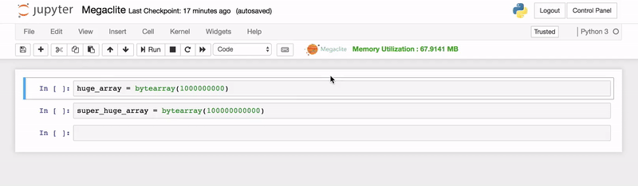
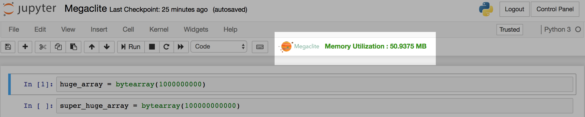

<p align="center">

</p>

# megaclite
## Resource Manager for JupyterHub, also a moon.

[](https://github.com/alivcor/segraph)
[](https://github.com/alivcor/segraph)
[](https://travis-ci.org/alivcor/megaclite)

<p align="center">

</p>


Megaclite provides monitoring, auditing & management for JupyterHub.

<a href="https://github.com/alivcor/megaclite">:octocat: Link to GitHub Repo</a>

## Getting Started

Megaclite provides the following functionalities:

- A small label in the toolbar to display memory utilization (summed across all notebooks) on client side
- Warning pop-up when user exhausts 75% of his/her memory limit on client-side.
- Alert pop-up when user crosses his/her memory limit on client-side.
- Kills kernel/session when user surpasses the limits.
- Auditing on server-side.

Make sure you have sudospawner up and running.

### Prerequisites

You will need to have Sudospawner installed on your system. The megaclite extension was built with Python 3.6, and it is NOT made for Python 2.7, so is JupyterHub.

```
pip install megaclite
```

### Installation

There are multiple ways to install megaclite on your system:

#### Python Package Index

megaclite is now available at https://pypi.python.org/pypi/megaclite/0.1


```
1. Download the tar/zip from https://pypi.python.org/pypi/megaclite/0.1
2. Move the package to your desired location / python version, and unzip the archive.
Optionally, if you have a linux-based machine (Ubuntu/OSX):
      tar xvzf megaclite-0.x.tar.gz -C /path/to/desireddirectory
3. Migrate to the megaclite folder, and run
      python setup.py install
```

#### Using pip

```
pip install megaclite
```

To upgrade,

```
pip install --upgrade megaclite
```


## Using megaclite

megaclite bouples BEST with Sudospawner. You need a JupyterHub API Token to use megaclite.

## Create an API token

To send requests using JupyterHub API, you must pass an API token with
the request.

As of version 0.6.0, the preferred way of
generating an API token is:

```bash
openssl rand -hex 32
```

This `openssl` command generates a potential token that can then be
added to JupyterHub using `.api_tokens` configuration setting in
`jupyterhub_config.py`.

Alternatively, use the `jupyterhub token` command to generate a token
for a specific hub user by passing the 'username':

```bash
jupyterhub token <username>
```

This command generates a random string to use as a token and registers
it for the given user with the Hub's database.

In JupyterHub version 0.8.0, a TOKEN request page for
generating an API token is available from the JupyterHub user interface:


## Add API tokens to the config file

You may also add a dictionary of API tokens and usernames to the hub's
configuration file, `jupyterhub_config.py` (note that
the **key** is the 'secret-token' while the **value** is the 'username'):

```python
c.JupyterHub.api_tokens = {
    'secret-token': 'username',
}
```


## Make the username an admin

This is required to be able to kill sessions in the event of user surpassing memory limits.


```python
c.JupyterHub.admin_users = {'username'}
```

NOTE: If you skip this, Megaclite will NOT be able to kill sessions.

## Enabling the extension

install both the serverextension and the toolbar button (nbextension) with:

```bash
pip install megaclite
jupyter serverextension enable --py megaclite --sys-prefix
jupyter nbextension install --py megaclite --sys-prefix
jupyter nbextension enable --py megaclite --sys-prefix
```

You can check that the install was successful with:
```bash
jupyter nbextension list
jupyter serverextension list
```

You may also enable it from the nbextensions-configurator UI.

## See the magic unleash

<p align="center">

</p>


## Contributing

You are welcome to raise issues / send a pull-request.


## Authors

* **Abhinandan Dubey** - *@alivcor* - [Human Interaction Lab, Stony Brook University](https://www.cs.stonybrook.edu/~adubey)


## License

This project is licensed under the MIT License - see the [LICENSE.md](LICENSE.md) file for details

[](https://github.com/alivcor/segraph/#)
